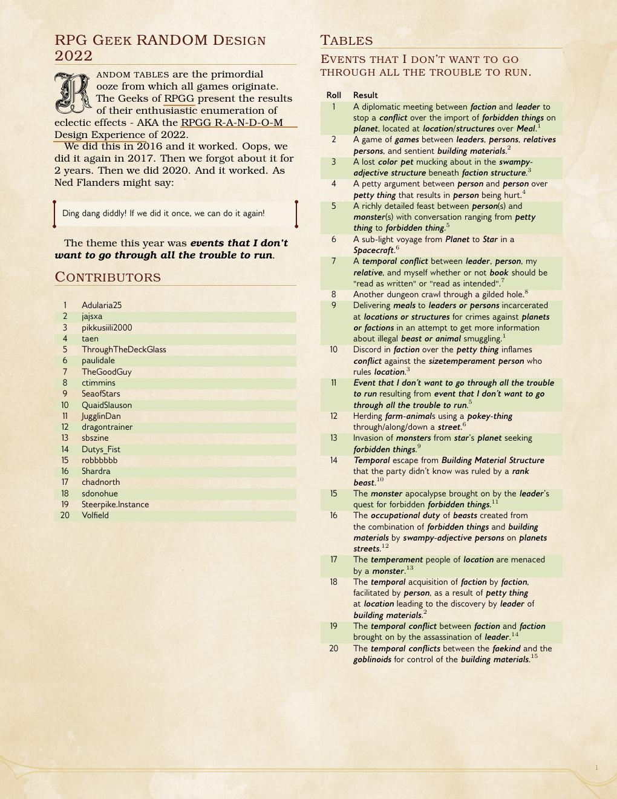

# R-A-N-D-O-M Design Experience 2022

## *Draft - Experience In Progress*

The compiled list of random tables from the RPG Geek 2022 [R-A-N-D-O-M Design
Experience](https://rpggeek.com/thread/2942480/2022-r-n-d-o-m-design-experience).

## Contributing

Fork the repo and submit pull-requests in the usual way.

### To Compile the Documents

You need a working Tex environment. I use `texlive-full` in Ubuntu. If you know
what you are doing you could work out the required packages for a minimal Tex
environment by looking at `header.tex`.

You will also need to install the [DND 5e LaTeX Template
package](https://github.com/rpgtex/DND-5e-LaTeX-Template).

You will also require `Make` to use the `Makefile`.

### To Add a New Table

1. Copy the `_table_template.tex` file to a new file with an appropriate name.
2. `\input` the new table into the required location in
   `events_I_dont_want_to_run.tex`.
3. Compile and test.

## Preview

